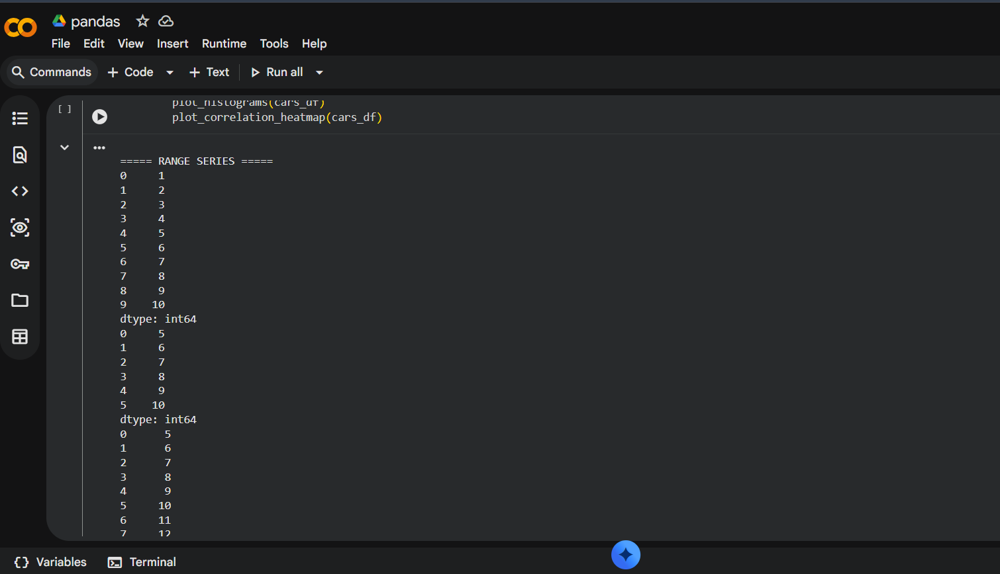

# 🤖 AI/ML Project

## 📌 Description
This project demonstrates the use of machine learning techniques to solve real-world problems using data.

## 🚀 Features
- Data preprocessing
- Model training
- Prediction system

## 🛠️ Technologies Used
- Python
- Pandas
- NumPy
- Scikit-learn

## ▶️ How to Run
1. Install required libraries
2. Run the Python file

## 📸 Output
(Add your output screenshot here)
# pandas-practice
This project demonstrates the use of Pandas and NumPy for data analysis and manipulation. It includes various operations such as data cleaning, transformation, and visualization. The project is useful for understanding how to work with datasets efficiently using Python libraries.
## 📸 Output

